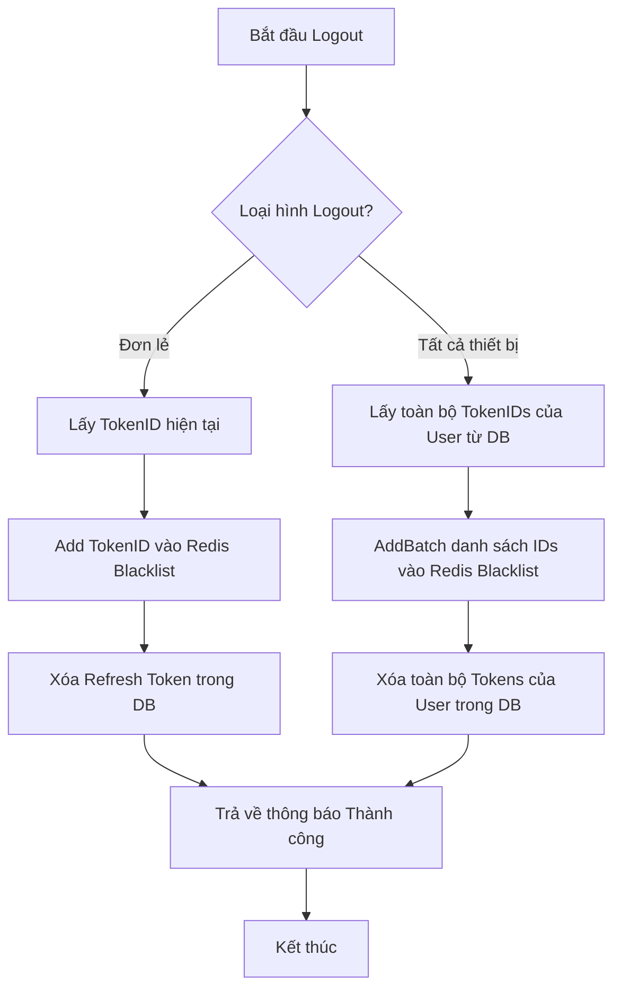

# Tài liệu Luồng Đăng xuất & Thu hồi Quyền truy cập (Token Revocation)

Tài liệu này trình bày quy trình đăng xuất an toàn, bao gồm việc xóa phiên làm việc trong Database và vô hiệu hóa Access Token lập tức thông qua Redis Blacklist.

## 1. Cơ chế Đăng xuất đơn lẻ (Single Logout)
Khi người dùng thực hiện đăng xuất trên một thiết bị cụ thể, hệ thống sẽ thực hiện theo các bước sau:

1. **Xác thực**: Nhận diện người dùng thông qua Access Token gửi kèm trong Header `Authorization`.
2. **Thu hồi quyền (Blacklisting)**: 
   - Lấy `TokenID` (JTI) từ thông tin Token.
   - Thêm `TokenID` này vào **Redis Blacklist** với thời gian sống (TTL) bằng thời gian hết hạn còn lại của Token (mặc định theo `ACCESS_TOKEN_EXPIRY_HOUR`).
3. **Xóa phiên trong DB**: Xóa bản ghi Refresh Token tương ứng trong Database để ngăn chặn việc sử dụng cho các yêu cầu `Refresh Token` sau này.

## 2. Cơ chế Đăng xuất toàn bộ (Logout All Devices)
Đây là tính năng cho phép người dùng vô hiệu hóa **tất cả các phiên làm việc** đang hoạt động (ví dụ: khi đổi mật khẩu hoặc bị lộ tài khoản).

1. **Truy vấn**: Hệ thống quét toàn bộ các phiên làm việc (Tokens) của User trong Database.
2. **Xử lý hàng loạt (Batch Processing)**:
   - Thu thập toàn bộ danh sách `TokenID`.
   - Sử dụng cơ chế **Redis Pipeline** hoặc **Batch Add** để đẩy toàn bộ danh sách này vào Redis Blacklist trong một lần gọi duy nhất nhằm tối ưu hóa hiệu năng.
3. **Xóa sạch phiên**: Thực hiện xóa tất cả bản ghi session của User trong Database.

## 3. Quy trình xử lý (Sơ đồ Mermaid)

## 4. Bảo mật tại Middleware
Hệ thống sử dụng `JwtAuthMiddleware` để kiểm tra mọi yêu cầu API có bảo mật:
- Mỗi yêu cầu sẽ truy vấn nhanh vào Redis để kiểm tra `TokenID` có nằm trong danh sách đen hay không.
- Nếu có, yêu cầu bị từ chối ngay lập tức với mã lỗi `401 Unauthorized`, kể cả khi Access Token vẫn còn hạn sử dụng.

---
**Lưu ý**: Việc kết hợp giữa DB (để quản lý phiên lâu dài) và Redis (để thu hồi tức thì) mang lại sự cân bằng giữa hiệu suất và tính bảo mật cao nhất cho hệ thống.
