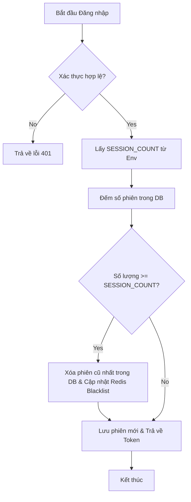

# Tài liệu Luồng Đăng nhập & Quản lý Phiên làm việc (Multi-Session Limit)

Tài liệu này trình bày giải pháp xử lý đăng nhập an toàn, giới hạn số lượng thiết bị đồng thời và cơ chế thu hồi quyền truy cập tức thì dựa trên cấu hình hệ thống.

## 1. Cơ chế Multi-Session Limit (MSL)
Để kiểm soát số lượng phiên làm việc active, hệ thống sử dụng biến môi trường `SESSION_COUNT` để xác định mức giới hạn cho mỗi tài khoản.

### Logic xử lý khi Đăng nhập:
1. **Xác thực**: Kiểm tra thông tin đăng nhập của người dùng.
2. **Kiểm soát số lượng**: 
   - Lấy giá trị giới hạn từ biến cấu hình `SESSION_COUNT` (mặc định là 5 nếu không được thiết lập).
   - Đếm số phiên làm việc hiện có trong Database cho User hiện tại.
3. **Thu hồi (Eviction)**: 
   - Nếu `Số lượng hiện tại >= SESSION_COUNT`:
     - Xác định phiên làm việc **cũ nhất** (dựa trên thời gian tạo) và xóa khỏi Database.
     - Đẩy ID của phiên bị xóa này vào **Redis Blacklist** để vô hiệu hóa ngay lập tức mọi Access Token liên quan.
4. **Cấp phát mới**: Tạo và lưu trữ phiên làm việc mới vào Database.

## 2. Cơ chế Blacklist với Redis
Do Access Token (JWT) có tính chất stateless, việc xóa dữ liệu trong Database không thể làm ngừng hiệu lực của các Access Token hiện có. Redis đóng vai trò là một "bảng chặn nhanh".

### Cách thức hoạt động:
- **Key Structure**: `blacklist:<RefreshTokenID>`
- **TTL (Time-To-Live)**: Được thiết lập tương ứng với thời gian hết hạn của Access Token (`ACCESS_TOKEN_EXPIRY_HOUR`).
- **Middleware**: Mọi yêu cầu API cần Access token sẽ thực hiện kiểm tra JTI (ID phiên) trong Redis. Nếu trùng khớp với danh sách chặn, yêu cầu bị từ chối với lỗi `401 Unauthorized`.

## 3. Cấu hình môi trường (.env)
Các tham số quan trọng cần lưu ý:
- `SESSION_COUNT`: Số lượng thiết bị tối đa được phép đăng nhập đồng thời.
- `ACCESS_TOKEN_EXPIRY_HOUR`: Thời gian sống của Access Token, quyết định thời gian lưu trữ trong Blacklist.

## 4. Sơ đồ xử lý tổng quát

