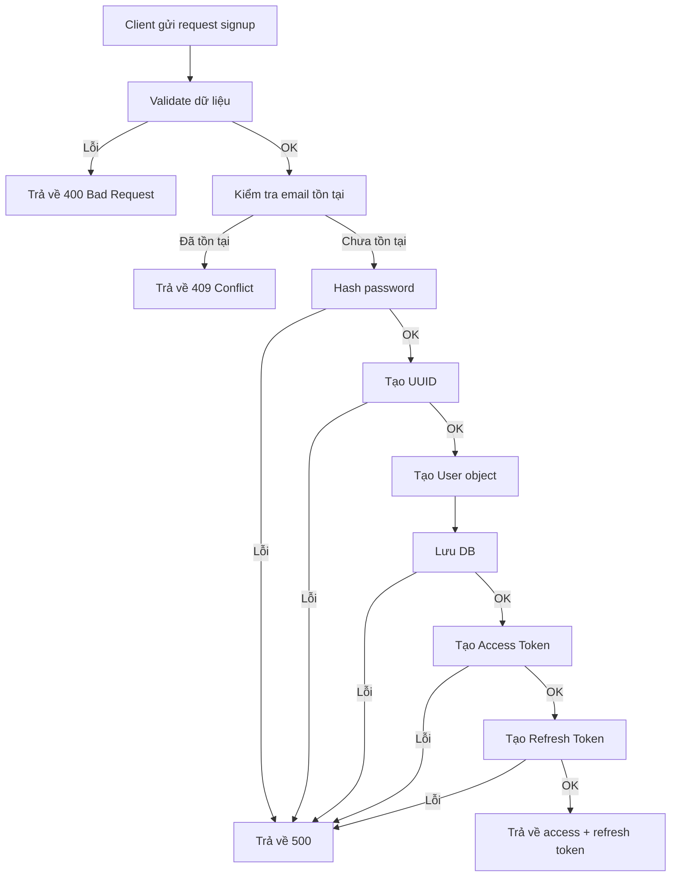

# Tài liệu mô tả flow Đăng ký (Signup Flow)

## 1. Tổng quan

Flow đăng ký cho phép người dùng tạo tài khoản mới bằng email và password. 
Quy trình bao gồm các bước validate dữ liệu, kiểm tra trùng email, mã hóa mật khẩu, lưu user và sinh token.

---

## 2. Các bước xử lý chi tiết

### Bước 1: Nhận request từ client
- API nhận request từ client thông qua HTTP (Gin Context)
- Body chứa:
  - name
  - email
  - password

---

### Bước 2: Validate dữ liệu đầu vào
- Sử dụng `ShouldBind` để bind dữ liệu vào struct `SignupRequest`
- Nếu lỗi:
  → Trả về `400 Bad Request`

---

### Bước 3: Kiểm tra email đã tồn tại chưa
- Gọi:
  `SignupUsecase.GetUserByEmail`

- Nếu **đã tồn tại user**:
  → Trả về `409 Conflict`
  → Message: "User already exists with the given email"

- Nếu **không tồn tại**:
  → Tiếp tục

---

### Bước 4: Mã hóa mật khẩu
- Sử dụng bcrypt:
  `bcrypt.GenerateFromPassword`

- Nếu lỗi:
  → Trả về `500 Internal Server Error`

- Nếu thành công:
  → Gán lại password đã hash

---

### Bước 5: Tạo User ID
- Sử dụng UUID v7:
  `uuid.NewV7()`

- Nếu lỗi:
  → Trả về `500 Internal Server Error`

---

### Bước 6: Tạo object User
- Mapping dữ liệu:
  - ID
  - Name
  - Email
  - Password (đã hash)

---

### Bước 7: Lưu user vào database
- Gọi:
  `SignupUsecase.Create`

- Chèn user vào bảng `users`, nếu thành công thì gán role "user" cho user.

- Nếu lỗi:
  → Trả về `500 Internal Server Error`

---

---

### Bước 8: Tạo Access Token
- Gọi:
  `CreateAccessToken`
- Sử dụng:
  - AccessTokenSecret
  - ExpiryHour

- Nếu lỗi:
  → Trả về `500 Internal Server Error`

---

### Bước 9: Tạo Refresh Token
- Gọi:
  `CreateRefreshToken`
- Sử dụng:
  - RefreshTokenSecret
  - ExpiryHour

- Nếu lỗi:
  → Trả về `500 Internal Server Error`

### Bước 10: Trả response về client
- Trả về:
  - access_token
  - refresh_token

- HTTP Status: `200 OK`

---

## 3. Sơ đồ Activity Diagram

## 4. Các điểm cần lưu ý
- Password luôn phải được hash, không lưu plaintext
- Email phải unique
- Có thể bổ sung:
    - Email verification
    - Rate limiting
    - Captcha chống spam